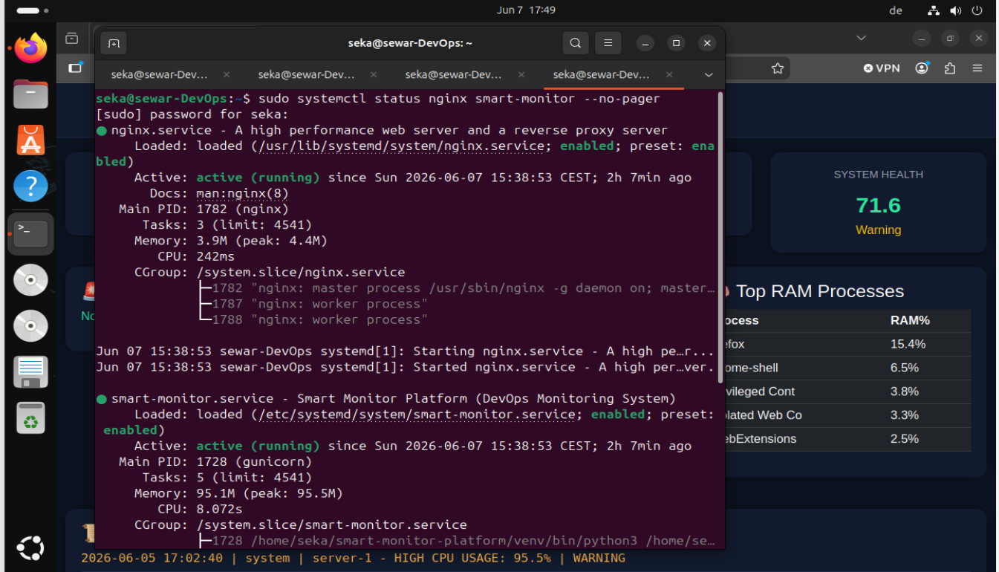

# Smart Monitor Platform


A Linux-based real-time monitoring system engineered for cloud environments, featuring containerized orchestration using **Docker**, **Flask**, **PostgreSQL**, **Gunicorn**, and **Nginx**.  
The project simulates a highly scalable, production-grade DevOps deployment environment.

---

## Recent Architecture Update: Multi-Container Dockerization
The platform has been fully containerized using a microservices architecture managed via **Docker Compose**. This ensures environment isolation, persistent storage data layers, and seamless dependency staging.

---

## Tech Stack

- **Containerization & Orchestration:** Docker, Docker Compose
- **Backend Framework:** Python 3, Flask (REST API)
- **Database Layer:** PostgreSQL 15 (Enterprise Persistent Storage)
- **Metrics Engine:** psutil (Host telemetry extraction)
- **WSGI Production Server:** Gunicorn
- **Reverse Proxy / Edge Routing:** Nginx
- **Target Environment:** Linux (Ubuntu/Debian), WSL2 Staging Environment
- 
---

## Live System Dashboard

Here is the running interface of the platform, capturing live performance metrics directly from the host system.


*Figure 1: Real-time system monitoring dashboard metrics overview.*


*Figure 2: Process monitoring and resource allocation view.*

---


## System Architecture
```bash
┌──────────────────────────────┐
│        Client Browser        │
└──────────────┬───────────────┘
               │ HTTP (port 80)
               ▼
┌──────────────────────────────┐
│            Nginx             │  ← Reverse Proxy / Edge Router
│  - Static asset caching      │
│  - Port 80 Proxy Routing     │
└──────────────┬───────────────┘
               │ Internal Forward
               ▼
┌────────────────────────────────────────────────────────────────────────┐
│                        DOCKER COMPOSE NETWORK                          │
│                                                                        │
│   ┌──────────────────────────┐            ┌────────────────────────┐   │
│   │  Flask Backend Container │            │  PostgreSQL Container  │   │
│   │                          ├───────────►│                        │   │
│   │  - Gunicorn Server       │  Isolated  │  - Port 5432           │   │
│   │  - Metrics Aggregator    │  Bridge    │  - Volume Persistence  │   │
│   │  - Telemetry API         │  Network   │  - Production DB Engine│   │
│   └──────────────────────────┘            └────────────────────────┘   │
└────────────────────────────────────────────────────────────────────────┘
                               │
                               ▼
┌────────────────────────────────────────────────────────────────────────┐
│                    LINUX SYSTEM TELEMETRY LAYER                        │
│  - Host CPU / RAM / Disk Metrics Data Stream                           │
│  - Kernel Process Inspection Pipeline                                  │
└────────────────────────────────────────────────────────────────────────┘
```
---
## Project Structure
```bash
smart-monitor-platform/
│
├── docker-compose.yml   # Multi-container orchestration (Postgres + Flask Engine)
├── .gitignore
├── README.md
│
├── core/                # Core telemetry engine
│   ├── metrics.py       # Host resource analytics collector
│   ├── alerts.py        # Subsystem notification alerting trigger
│   ├── analyzer.py      # Micro-process structural analysis
│   ├── logger.py        # System log tracing matrix
│   ├── database.py      # PostgreSQL abstraction mapping Layer
│   └── processes.py     # Task manager analytics tracker
│
├── dashboard/           # UI Web Engine Application Container
│   ├── Dockerfile       # Custom isolated container build configuration
│   ├── app.py           # Flask entry-point deployment script
│   ├── requirements.txt # Production python dependencies
│   ├── templates/       # Jinja2 frontend components
│   └── static/          # Native style and assets
│
└── screenshots/         # Infrastructure runtime logs & DB
└── README.md
```
---

## Installation & Rapid Deployment (Docker Way)
The preferred, modern way to spin up the entire ecosystem with zero manual database or runtime configuration:

### systemd service setup
...
1. Clone repository

``` bash
git clone git@github.com:sewar1/smart-monitor-platform.git
cd smart-monitor-platform
```
2. Launch Infrastructure with One Command
``` bash
docker-compose up --build
```
This handles database initialization, automated network bridging, Python image building, and production server spawning.

The dashboard will be immediately accessible on: http://localhost:5000

## Legacy Native Linux Deployment (Alternative Setup)
If you wish to deploy directly to bare-metal systemd layers without containers (Simulated on VMware Bare-Metal):
1. Create virtual environment & dependencies
``` bash
python3 -m venv venv
source venv/bin/activate
pip install flask psutil requests gunicorn psycopg2-binary
```
2. Running the Application
   Development mode:
   ``` bash
   python dashboard/app.py
    ```
    Production execution via Gunicorn
    ```bash
    gunicorn --bind 0.0.0.0:5000 dashboard.app:app
    ```
---
3. systemd Service Setup (/etc/systemd/system/smart-monitor.service)
```bash
[Unit]
Description=Smart Monitor Platform
After=network.target

[Service]
User=seka
WorkingDirectory=/home/seka/smart-monitor-platform
ExecStart=/home/seka/smart-monitor-platform/venv/bin/gunicorn --bind 127.0.0.1:5000 dashboard.app:app
Restart=always

[Install]
WantedBy=multi-user.target
```
### Enable and start service
``` bash
sudo systemctl daemon-reload
sudo systemctl enable smart-monitor
sudo systemctl start smart-monitor
```
4. Nginx configuration
```bash
server {
    listen 80;
    server_name _;

    location / {
        proxy_pass http://127.0.0.1:5000;

        proxy_set_header Host $host;
        proxy_set_header X-Real-IP $remote_addr;
        proxy_set_header X-Forwarded-For $proxy_add_x_forwarded_for;
        proxy_set_header X-Forwarded-Proto $scheme;
    }
}
```
Reload Nginx:
``` bash
sudo nginx -t
sudo systemctl reload nginx
```
---

#### Production Deployment & Infrastructure Status

The application is integrated into the Linux service layers via systemd and Nginx. Below is the verified status of the services running in production.


*Figure 3: Active production verification for reverse proxy and backend services.*

---

## Production Verification (VMware Infrastructure Status)
Below is the verified operational status of the core infrastructure daemons running natively on the Linux server.

Figure 3: Active production verification for reverse proxy and systemd backend services.


## API Endpoint
### GET /api/metrics
Returns uniform real-time infrastructure data matrix payloads:
```bash

Returns real-time system metrics:
{
  "health": {
    "score": 73.0,
    "status": "Warning"
  },
  "nodes": [
    {
      "name": "server-1",
      "cpu": 5.6,
      "ram": 44.7,
      "disk": 33.6
    }
  ],
  "alerts": []
}
```
---
### Proof of Deployment Flow
```bash
Flask App ──► Gunicorn (WSGI) ──► systemd Daemon ──► Nginx Reverse Proxy ──► Linux Host Engine
```
## Core Capabilities Demonstrated
Microservices Orchestration: Managing interconnected isolated infrastructure networks.

Enterprise DB Management: Integrating persistent container storage with PostgreSQL volumes.

Reverse Proxy Routing: Multi-tiered network gateway configuration via Nginx.

Process Automation: Managing underlying platform services with systemd daemons.

---

## Next Architectural Roadmap

-  **Phase 1: Agent/Server Architecture Consolidation**
  - Refactor the core telemetry collector into a standalone, lightweight daemon script (`Agent`).
  - Implement dynamic HTTP/HTTPS POST streaming to forward centralized host metrics to the main controller (`Server`).
  
-  **Phase 2: Test-Driven Stability Framework**
  - Write comprehensive **Unit Tests** and Integration Tests for core telemetry ingestion pipelines.
  - Establish a solid testing baseline to guarantee system stability during subsequent feature staging.

-  **Phase 3: Enterprise Security & Authentication Ring**
  - Implement a secure user access management system with isolated administrative roles.
  - Integrate **JWT (JSON Web Tokens)** for stateless backend API session security.
  - Enforce cryptographic password hashing using the **bcrypt** algorithm.

-  **Phase 4: Automated Disaster Recovery Subsystem**
  - Build an automated backup utility engine for PostgreSQL transaction logs and configuration data layers.
  - Implement cron-driven scheduled snapshots to preserve historical metric states.

-  **Phase 5: PostgreSQL Core Analytics Pipeline**
  - Build advanced analytical backend queries inside PostgreSQL to process and analyze long-term performance trends and historical server logs.

-  **Phase 6: Continuous Integration / Continuous Deployment (CI/CD)**
  - Construct a robust CI/CD workflow pipeline via **GitHub Actions** to automate codebase auditing, test suite execution, and live container deployment.
---

## Summary

This project demonstrates a complete DevOps lifecycle from development to containerized orchestration and bare-metal production deployment on an enterprise virtualized Linux server.
