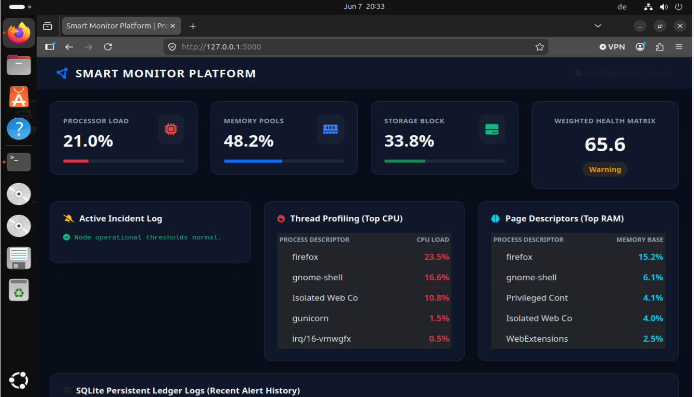
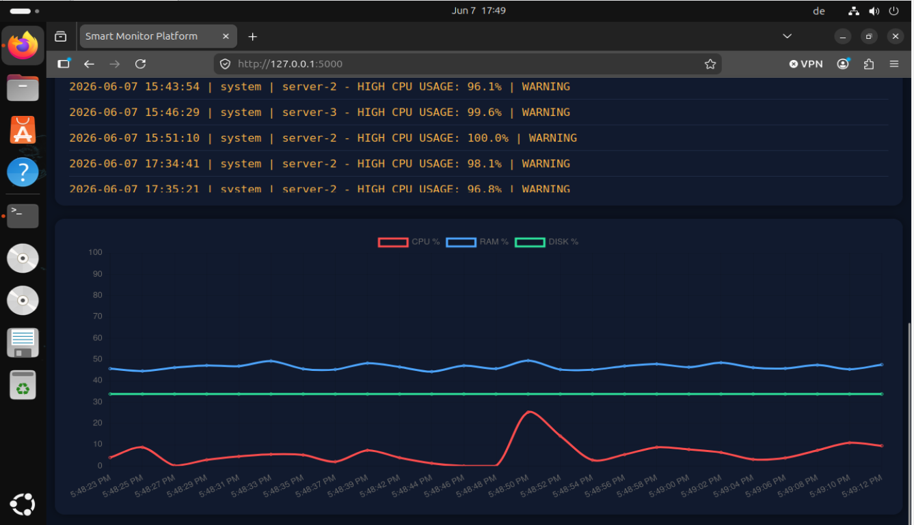

# Operational Core & Deep Infrastructure Subsystems
The `core` directory serves as the decoupled, underlying business logic backbone of the whole platform. It maps data transformations, handles alerts, and controls relational data operations.

## Functional Structural Subsystems
- **PostgreSQL Abstraction Mapping (`database.py`):** Establishes an enterprise thread-safe database pooling routine using psycopg2.pool.SimpleConnectionPool. Manages transactional rollbacks, handles safe connection release cycles, and abstracts database queries to protect against resource starvation under high-frequency loads.
- **Enterprise Notification Alerters (`alerts.py`, `mailer.py`):** Evaluates incoming telemetry signals against dynamic thresholds. Extends pipelines to route real-time critical anomaly payloads out to dedicated administrative Telegram Bots and transactional SMTP email servers
- **Process Profiler & Reactive OOM Anti-Freeze Guard (processes.py, analyzer.py):** Inspects active runtime PIDs across host environments. Features a reactive daemon that automatically triggers when CPU or RAM crosses a critical $95.0\%$ threshold. It evaluates tasks against a strict case-insensitive infrastructure whitelist and dispatches targeted SIGTERM/termination loops to clear rogue processes safely
- **Cryptographic Security Ring (`security.py`):** Powers application security and Identity Management (IAM). Implements constant-time bcrypt salting routines to secure credentials and structures stateless token validation rings using JWT (JSON Web Tokens)

## Structural File Blueprint
- **`database.py`**: Singleton pool managers maintaining isolated connections talking directly to PostgreSQL
- **`security.py`**: Cryptographic gateway securing user password vectors and handling stateless verification tokens
- **`analyzer.py`** The reactive system optimization and anti-freeze mitigation engine
- **`alerts.py` & `mailer.py`**: Automated alerts orchestration and multi-channel delivery workers
- **`metrics.py` & `processes.py`**: Telemetry translators converting low-level raw OS kernel sensor states into tabular data mappings


## Legacy Native Linux Deployment (Alternative Setup)
If you wish to deploy directly to bare-metal systemd layers without containers (Simulated on VMware Bare-Metal):

**1. Create virtual environment & dependencies**
```bash
python3 -m venv venv
source venv/bin/activate
pip install flask psutil requests gunicorn psycopg2-binary python-dotenv PyJWT bcrypt
```
**2. Running the Application**
- 2.1. Development mode:
```bash
python dashboard/app.py
```
- 2.2. Production execution via Gunicorn
```bash
gunicorn --bind 0.0.0.0:5000 dashboard.app:app
```

**3. systemd Service Setup** (/etc/systemd/system/smart-monitor.service)
```bash
[Unit]
Description=Smart Monitor Platform Central Core
After=network.target

[Service]
User=seka
WorkingDirectory=/home/seka/smart-monitor-platform
Environment="PYTHONPATH=/home/seka/smart-monitor-platform"
ExecStart=/home/seka/smart-monitor-platform/venv/bin/gunicorn --bind 127.0.0.1:5000 dashboard.app:app
Restart=always

[Install]
WantedBy=multi-user.target
```
### Enable and start service
```bash
sudo systemctl daemon-reload
sudo systemctl enable smart-monitor
sudo systemctl start smart-monitor
```
**4. Nginx configuration**
```bash
server {
    listen 80;
    server_name _; # Fixed legacy typo from node_id to server_name

    location / {
        proxy_pass http://127.0.0.1:5000;
        proxy_http_version 1.1;

        proxy_set_header Host $host;
        proxy_set_header X-Real-IP $remote_addr;
        proxy_set_header X-Forwarded-For $proxy_add_x_forwarded_for;
        proxy_set_header X-Forwarded-Proto $scheme;
    }
}
```

## Verification & Reload:
``` bash
sudo nginx -t
sudo systemctl reload nginx
```
---

## Live System Dashboard

Here is the running interface of the platform, capturing live performance metrics directly from the host system.


*Figure 1: Real-time system monitoring dashboard metrics overview.*


*Figure 2: Process monitoring and resource allocation view.*


---

## Production Verification (VMware Infrastructure Status)
Below is the verified operational status of the core infrastructure daemons running natively on the Linux server.

Figure 3: Active production verification for reverse proxy and systemd backend services.
